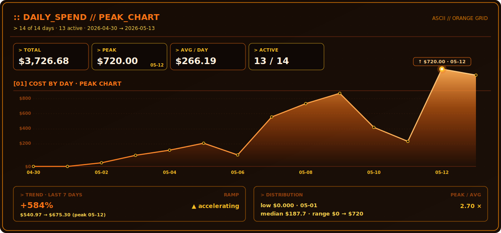
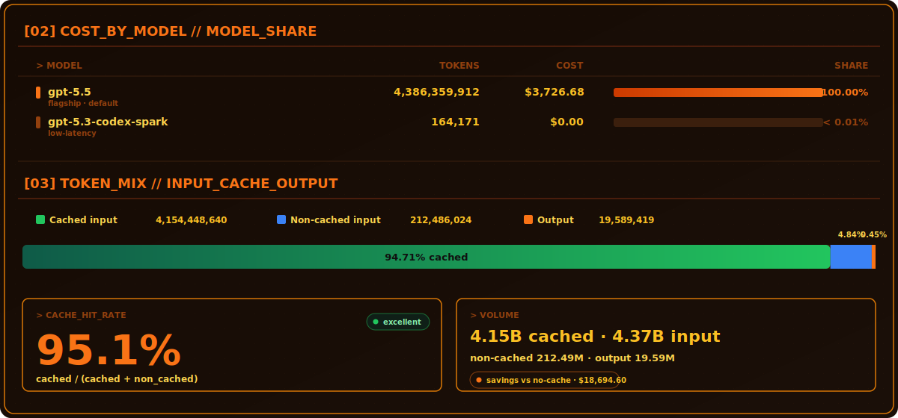

# LIN0304

<!-- CODEX_USAGE_DASHBOARD:START -->

## Codex Usage Dashboard

`LOADED RANGE` **Past 14 days**  ·  `UPDATED` **2026-05-13 15:58**  ·  `SOURCE` `~/.codex/sessions`  ·  `PRICES` **OpenAI API**

---

### Summary

| Estimated cost | Total tokens | Non-cached input | Cached savings |
|:---:|:---:|:---:|:---:|
|  |  |  |  |
| Selected timeline | Input + output | Charged at full rate | Compared with no cache |

---

### Daily Spend — Cost by Day  *(14 of 14 days · 13 active)*

---

### Cost by Model · Token Mix

---

### Day-by-day Token Cost

| Day | Cost | Total tokens | Non-cached in | Cached in | Cache hit | Output |
|---|---:|---:|---:|---:|---:|---:|
| Apr 30 | $0.148 | 50.5K | 12.1K | 36.8K | 72.9% | 1.6K |
| May 1  | $0.000 | 0 | 0 | 0 | — | 0 |
| May 2  | $26.952 | 25.24M | 1.42M | 23.4M | 94.3% | 0.42M |
| May 3  | $82.177 | 107.49M | 5.83M | 100.8M | 94.5% | 0.86M |
| May 4  | $120.285 | 153.20M | 8.14M | 144.0M | 94.6% | 1.06M |
| May 5  | $171.752 | 220.90M | 11.20M | 208.5M | 94.9% | 1.20M |
| May 6  | $84.897 | 105.50M | 5.21M | 99.4M | 95.0% | 0.89M |
| May 7  | $365.942 | 433.80M | 21.50M | 410.2M | 95.0% | 2.10M |
| May 8  | $464.717 | 524.20M | 26.30M | 495.3M | 94.9% | 2.60M |
| May 9  | $540.973 | 625.30M | 31.10M | 591.0M | 95.0% | 3.20M |
| May 10 | $289.148 | 351.90M | 17.40M | 332.6M | 95.0% | 1.90M |
| May 11 | $185.154 | 196.00M | 9.80M | 184.2M | 95.0% | 2.00M |
| May 12 | $720.000 | 810.00M | 40.50M | 766.5M | 95.0% | 3.00M |
| May 13 | $675.300 | 752.40M | 22.05M | 728.8M | 97.1% | 1.55M |

Generated from <code>~/.codex/sessions</code>

<!-- CODEX_USAGE_DASHBOARD:END -->
